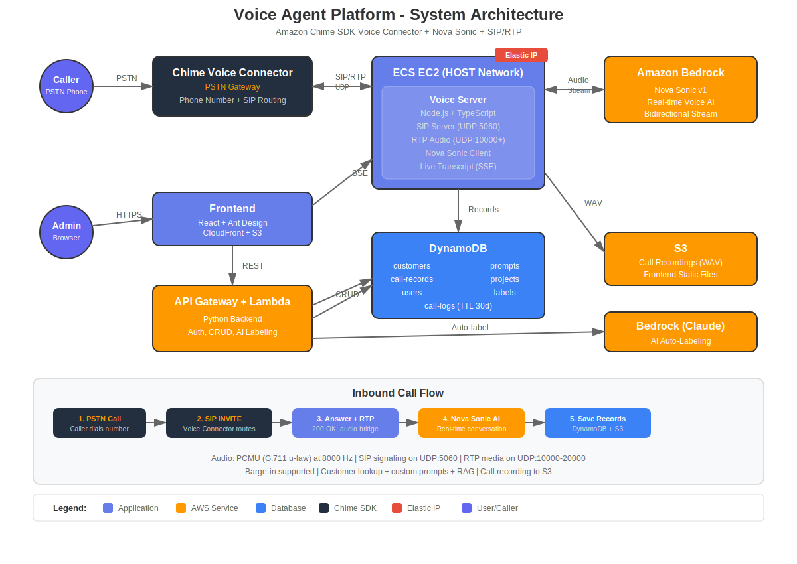

# Voice Agent Platform

An enterprise-grade voice AI outbound calling platform built on AWS and Amazon Nova Sonic, featuring real-time voice conversations, multi-project management, call monitoring, and intelligent labeling system.



## 📋 Table of Contents

- [Features](#-features)
- [System Architecture](#-system-architecture)
- [Tech Stack](#-tech-stack)
- [Prerequisites](#-prerequisites)
- [Installation](#-installation)
- [Configuration](#-configuration)
- [User Guide](#-user-guide)
- [API Documentation](#-api-documentation)
- [Security](#-security)
- [Troubleshooting](#-troubleshooting)

## 🚀 Features

### Core Features

#### 1. **User Authentication System**
- 🔐 JWT Token authentication
- 📧 Invite code registration
- 👤 User login/logout
- 🔒 Global API protection

#### 2. **Multi-Project Management**
- 📊 Project-based isolation
- 📈 Project dashboard with statistics
- ⚙️ Project-level configuration

#### 3. **Customer Management**
- 👥 Customer information management (name, phone, notes)
- 📥 CSV bulk import
- 🏷️ Customer labels display (latest call)
- 📞 Single/batch outbound calls

#### 4. **Prompt Management**
- 📝 Custom AI prompt templates
- 🔄 Variable substitution support (`{{customer_name}}`, `{{notes}}`)
- 💾 Prompt versioning
- 🌐 Project-level/global prompts

#### 5. **Flow Management**
- 🎯 Call flow configuration
- 🔊 Voice selection (Nova Sonic voices)
- ⚡ Flow activation/deactivation

#### 6. **Real-time Call Monitoring (Live Monitor)**
- 📡 Active calls real-time display
- 💬 Real-time transcript viewing (SSE streaming)
- ⏱️ Call duration statistics
- 👁️ Conversation turn monitoring

#### 7. **Call History Management**
- 📜 Complete call records
- 💭 Conversation transcript viewing
- 🗂️ Status filtering (completed/active)
- 🏷️ Manual label annotation
- 🤖 AI auto-labeling (Claude Sonnet 4.6)
- 🔍 Call logs viewing (Debug)

#### 8. **Label System (Label Management)**
- 🏷️ Custom label dimensions
- ☑️ Single/multiple selection support
- 🎨 Label visualization
- 🤖 AI automatic classification
- 📊 Label statistics analysis

#### 9. **Call Logging System**
- 📋 Detailed call event logs
- 🐛 Debug information recording
- ⏰ Auto-expiration after 30 days (TTL)
- 🔍 Query by call ID

### Technical Features

- ⚡ **Real-time Voice Processing**: Amazon Nova Sonic voice-to-voice AI
- 🌊 **Streaming Response**: WebSocket real-time communication
- 🔄 **Auto-retry Mechanism**: Error automatic recovery
- 📊 **Scalable Architecture**: ECS Fargate auto-scaling
- 🔒 **Enterprise Security**: JWT + environment variable configuration
- 🌐 **CDN Acceleration**: CloudFront global distribution
- 💾 **NoSQL Storage**: DynamoDB serverless database

## 🏗️ System Architecture

### Architecture Components

#### Frontend Layer
- **React + TypeScript**: Modern SPA application
- **Ant Design**: Enterprise UI component library
- **CloudFront + S3**: Static resource hosting and CDN

#### API Layer
- **API Gateway**: REST API entry point
- **Lambda (Python)**: Serverless business logic
  - User authentication
  - Customer management
  - Project management
  - Label configuration
  - AI auto-labeling

#### Voice Processing Layer
- **ECS EC2**: Containerized Node.js service (HOST networking for SIP/RTP)
- **Amazon Chime SDK Voice Connector**: PSTN phone gateway (SIP/RTP)
- **Amazon Nova Sonic**: Voice AI model

#### Data Layer
- **DynamoDB Tables**:
  - `outbound-users` - User authentication
  - `outbound-customers` - Customer information
  - `outbound-projects` - Project management
  - `outbound-prompts` - Prompt templates
  - `outbound-flow-configs` - Flow configuration
  - `outbound-call-records` - Call records
  - `label-configs` - Label configuration
  - `call-logs` - Call logs (with TTL)

### Data Flow

```
┌─────────┐     HTTPS     ┌────────────┐
│  User   │ ───────────> │  Frontend  │
└─────────┘               └─────┬──────┘
                                │
                    ┌───────────┴──────────┐
                    │                      │
              REST API              WebSocket (SSE)
                    │                      │
            ┌───────▼──────┐       ┌──────▼───────┐
            │ API Gateway  │       │ Voice Server │
            │      +       │       │   (ECS)      │
            │   Lambda     │       └──────┬───────┘
            └───────┬──────┘              │
                    │                     │
                    │              ┌──────▼───────┐
                    │              │ Chime Voice  │
                    │              │  Connector   │
                    │              │ (SIP/RTP)    │
                    │              └──────────────┘
                    │                     │
            ┌───────▼──────┐              │
            │   DynamoDB   │ <────────────┘
            └──────────────┘       Nova Sonic
                    │                     ▲
            ┌───────▼──────┐              │
            │   Bedrock    │──────────────┘
            │ (Nova Sonic) │
            └──────────────┘
```

## 💻 Tech Stack

### Frontend
- **Framework**: React 18 + TypeScript
- **UI Library**: Ant Design 5.x
- **State Management**: React Context API
- **HTTP Client**: Axios
- **Build Tool**: Vite

### Backend
- **Voice Service**: Node.js 20 + TypeScript
- **API Service**: Python 3.11
- **Web Framework**: Fastify (WebSocket)
- **Real-time Communication**: Server-Sent Events (SSE)

### AWS Services
- **Compute**: Lambda, ECS (EC2-backed)
- **Storage**: S3, DynamoDB
- **Network**: CloudFront, ALB, API Gateway
- **Container**: ECR
- **AI**: Amazon Bedrock (Nova Sonic)
- **Authentication**: Custom JWT system

### Phone Gateway
- **Voice Calls**: Amazon Chime SDK Voice Connector (SIP/RTP)
- **AI Labeling**: Anthropic Claude Sonnet 4.6

## 📦 Prerequisites

### Required
- AWS Account (with admin permissions and Amazon Chime SDK enabled)
- Amazon Chime SDK phone number (see [Chime Setup Guide](docs/CHIME_SETUP.en.md))
- Node.js >= 20
- Python >= 3.11
- Docker (for local build)
- AWS CLI v2
- Domain (optional, for production)

### AWS Configuration
```bash
# Configure AWS CLI
aws configure
# Input: Access Key, Secret Key, Region (us-east-1), Output format (json)

# Verify configuration
aws sts get-caller-identity
```

### Chime Voice Connector Configuration
See [Chime SDK Voice Connector Setup Guide](docs/CHIME_SETUP.en.md) for detailed steps.

Quick overview:
1. Provision a phone number in Amazon Chime SDK console
2. Create a Voice Connector and disable encryption requirement
3. Associate the phone number with the Voice Connector
4. After deployment, configure Origination to point to the Elastic IP

## 🚀 Installation

### 1. Clone Repository
```bash
git clone <repository-url>
cd voice-agent-platform
```

### 2. Configure Environment Variables

Copy environment template:
```bash
cp .env.example .env
```

Edit `.env` file with actual values:
```bash
# Chime Voice Connector
CHIME_VOICE_CONNECTOR_HOST=xxxxx.voiceconnector.chime.aws
CHIME_PHONE_NUMBER=+1XXXXXXXXXX

# AWS region
AWS_REGION=us-east-1

# Keep other configs as default
```

### 3. Configure Authentication Keys

Create security configuration file:
```bash
cd infra
cp .secrets.example .secrets
```

Edit `.secrets` file:
```bash
# Generate strong JWT Secret
openssl rand -hex 32

# Edit .secrets
nano .secrets
```

Fill in keys:
```bash
export JWT_SECRET="<generated 64-character random string>"
export INVITE_CODE="your-secret-invite-code"
```

### 4. Deploy Infrastructure

#### Full Deployment (First Time)
```bash
cd infra
source .secrets  # Load authentication keys
./deploy.sh      # Deploy all components
```

This will execute:
1. Create CloudFormation stack
2. Create all DynamoDB tables
3. Build and push Docker image to ECR
4. Deploy ECS service
5. Deploy Lambda function
6. Build and deploy frontend to S3

#### Step-by-step Deployment
```bash
# Deploy infrastructure only
./deploy.sh --stack-only

# Deploy voice server only (ECS)
./deploy.sh --deploy-only

# Deploy Lambda API only
./deploy.sh --lambda-only

# Deploy frontend only
./deploy.sh --frontend-only
```

### 5. Get Access URLs

After deployment, view outputs:
```bash
aws cloudformation describe-stacks \
  --stack-name voice-agent-platform \
  --query 'Stacks[0].Outputs'
```

Key outputs:
- **FrontendUrl**: Frontend access URL (e.g., `https://d2nwk8t6a2isa.cloudfront.net`)
- **GatewayPublicIP**: Voice gateway Elastic IP (for Voice Connector configuration)
- **ApiGatewayUrl**: API Gateway URL

### 6. Configure Voice Connector Origination

Use the `GatewayPublicIP` to configure the Voice Connector to route calls to your server. See [Chime Setup Guide](docs/CHIME_SETUP.en.md) Step 6 for details.

## ⚙️ Configuration

### Complete Environment Variables

#### Authentication & Security
```bash
JWT_SECRET=<64-character random string>    # JWT signing key
INVITE_CODE=<invite-code>                  # User registration invite code
```

#### Chime Voice Connector Configuration
```bash
CHIME_VOICE_CONNECTOR_HOST=xxxxx.voiceconnector.chime.aws  # Voice Connector hostname
CHIME_PHONE_NUMBER=+1XXXXXXXXXX      # Chime phone number
PUBLIC_IP=                            # Elastic IP (auto-set in ECS)
RTP_PORT_BASE=10000                   # RTP start port
RTP_PORT_COUNT=10000                  # RTP port range size
```

#### AWS Configuration
```bash
AWS_REGION=us-east-1                 # Primary region
CONNECT_REGION=us-west-2             # Amazon Connect region
DYNAMODB_REGION=us-east-1            # DynamoDB region
```

#### DynamoDB Table Names
```bash
CUSTOMERS_TABLE=outbound-customers
PROMPTS_TABLE=outbound-prompts
FLOWS_TABLE=outbound-flow-configs
CALL_RECORDS_TABLE=outbound-call-records
PROJECTS_TABLE=outbound-projects
LABEL_CONFIGS_TABLE=label-configs
USERS_TABLE=outbound-users
CALL_LOGS_TABLE=call-logs
```

#### Nova Sonic Configuration
```bash
VOICE_ID=tiffany                     # Voice ID (tiffany/matthew/joey/salli)
TEMPERATURE=0.7                      # Model temperature (0.0-1.0)
TOP_P=0.9                            # Top-p sampling
MAX_TOKENS=1024                      # Maximum tokens
MAX_CALL_DURATION_MS=1200000         # Max call duration (20 minutes)
```

## 📖 User Guide

### First Time Use

#### 1. Register Account
1. Visit frontend URL
2. Click "Register" tab
3. Fill in information:
   - Name
   - Email
   - Password (minimum 6 characters)
   - Invite Code
4. Auto-login after successful registration

#### 2. Create Project
1. Click "Manage" button at top
2. Click "Create Project"
3. Fill in project information:
   - Project Name
   - Description
   - Status (active/inactive)
4. Auto-switch to new project after saving

#### 3. Configure Prompts
1. Click "Prompts" in left menu
2. Click "Create Prompt" button
3. Fill in prompt:
   - Prompt Name
   - Prompt Content
     - Available variables: `{{customer_name}}`, `{{notes}}`
   - Active status
4. Save

#### 4. Import Customers
1. Click "Customers" in left menu
2. Click "Import CSV" button
3. Prepare CSV file format:
   ```csv
   customer_name,phone_number,email,notes,voice_id,prompt_id
   John Doe,+8613800138000,john@example.com,VIP customer,tiffany,prompt-id-xxx
   ```
4. Paste CSV content and submit

#### 5. Create Labels
1. Click "Labels" in left menu
2. Click "Create Label" button
3. Configure label:
   - Label Name (e.g., "Customer Intent")
   - Options (comma-separated list)
   - Selection Type (single/multiple)
4. Save

#### 6. Make Outbound Call
1. Select customer in "Customers" page
2. Click "Call" button
3. System automatically initiates call
4. View real-time call in "Live Monitor"

### Daily Use

#### View Real-time Calls
1. Click "Live Monitor"
2. View current active calls list
3. Click call to view real-time transcript

#### View Call History
1. Click "Call History"
2. View all call records
3. Click "View" to see conversation
4. Click "Label" for manual labeling
5. Click "Auto" for AI auto-labeling
6. Click "Logs" to view detailed logs

#### Label Management
**Manual Labeling**:
1. Click "Label" in Call History
2. Select/fill label values according to configuration
3. Save

**Auto-labeling**:
1. Click "Auto" in Call History
2. System uses Claude Sonnet 4.6 to analyze conversation
3. Automatically apply all configured labels

#### Enhanced Customer Management
- Customer list displays labels from latest call
- Label format: `Label Name: Value`
- Click customer to view details

## 📚 API Documentation

### Authentication API

#### Register
```http
POST /api/auth/register
Content-Type: application/json

{
  "email": "user@example.com",
  "password": "password123",
  "name": "John Doe",
  "invite_code": "your-invite-code"
}
```

#### Login
```http
POST /api/auth/login
Content-Type: application/json

{
  "email": "user@example.com",
  "password": "password123"
}
```

#### Verify Token
```http
GET /api/auth/verify
Authorization: Bearer <token>
```

### Customer Management API

#### List Customers
```http
GET /api/customers?project_id=<project_id>&limit=100
Authorization: Bearer <token>
```

#### Create Customer
```http
POST /api/customers
Authorization: Bearer <token>
Content-Type: application/json

{
  "customer_name": "John Doe",
  "phone_number": "+8613800138000",
  "email": "john@example.com",
  "notes": "VIP customer",
  "project_id": "project-id-xxx"
}
```

#### Bulk Import
```http
POST /api/customers/import
Authorization: Bearer <token>
Content-Type: application/json

{
  "csv_content": "customer_name,phone_number,...\nJohn Doe,+8613800138000,...",
  "project_id": "project-id-xxx"
}
```

### Call Records API

#### List Call Records
```http
GET /api/call-records?limit=100&status=completed
Authorization: Bearer <token>
```

#### Get Call Logs
```http
GET /api/call-records/{call_sid}/logs
Authorization: Bearer <token>
```

#### Update Call Labels
```http
PUT /api/call-records/{call_sid}/labels
Authorization: Bearer <token>
Content-Type: application/json

{
  "labels": {
    "label-id-1": "Option A",
    "label-id-2": ["Option 1", "Option 2"]
  }
}
```

#### AI Auto-labeling
```http
POST /api/call-records/{call_sid}/auto-label
Authorization: Bearer <token>
```

### Real-time Monitoring API

#### Active Calls List
```http
GET /api/active-calls
```

#### Real-time Transcript Stream (SSE)
```http
GET /api/live-transcript/{call_sid}
```

## 🔒 Security

### Authentication Mechanism
- **JWT Token**: 7-day validity
- **Password Encryption**: SHA256 hashing
- **Invite Code Verification**: Registration requires valid invite code
- **API Protection**: All business APIs require authentication

### Environment Variable Protection
- `.env` file added to `.gitignore`
- `.secrets` file added to `.gitignore`
- CloudFormation parameters use `NoEcho: true`

### Best Practices
1. **Regular Key Rotation**:
   ```bash
   # Generate new JWT Secret
   openssl rand -hex 32

   # Update CloudFormation
   source .secrets
   ./deploy.sh --stack-only
   ```

2. **Limit IAM Permissions**: Grant only necessary permissions
3. **Enable CloudTrail**: Audit all API calls
4. **Regular DynamoDB Backup**: Enable Point-in-Time Recovery
5. **Monitor Abnormal Logins**: Set up CloudWatch alarms

## 🐛 Troubleshooting

### Frontend Not Accessible
**Symptom**: Frontend page 404 or loading failure

**Solution**:
```bash
# Check CloudFront distribution status
aws cloudfront list-distributions

# Clear CloudFront cache
aws cloudfront create-invalidation \
  --distribution-id <DISTRIBUTION_ID> \
  --paths "/*"
```

### Login Failure
**Symptom**: "Invalid email or password" error

**Solution**:
1. Check if JWT_SECRET is correctly configured
2. Verify Lambda environment variables:
   ```bash
   aws lambda get-function-configuration \
     --function-name outbound-api \
     --query 'Environment.Variables'
   ```
3. View Lambda logs:
   ```bash
   aws logs tail /aws/lambda/outbound-api --follow
   ```

### Call Connection Failure
**Symptom**: No response or immediate hangup after clicking Call

**Solution**:
1. Verify Voice Connector `RequireEncryption` is `false`
2. Verify Origination points to the correct Elastic IP on port 5060/UDP
3. Verify security groups allow inbound UDP 5060 and UDP 10000-20000
4. Verify the Elastic IP is associated with the EC2 instance
5. Verify ECS service status:
   ```bash
   aws ecs describe-services \
     --cluster voice-agent-cluster \
     --services voice-agent-sip-service
   ```
6. View ECS logs:
   ```bash
   aws logs tail /ecs/voice-agent-server --follow --region us-east-1
   ```
7. See [Chime Setup Guide - Troubleshooting](docs/CHIME_SETUP.en.md#troubleshooting) for details

### No Real-time Transcript
**Symptom**: Live Monitor shows call but no transcript

**Solution**:
1. Check browser console for SSE connection errors
2. Verify CORS configuration
3. Check WebSocket/SSE connection

## 📊 Monitoring and Logging

### CloudWatch Log Locations
- **Lambda API**: `/aws/lambda/outbound-api`
- **Voice Server**: `/ecs/voice-agent-service`
- **Call Logs**: Stored in DynamoDB `call-logs` table (30-day TTL)

### Key Metrics
- Lambda invocation count, error rate
- DynamoDB read/write capacity
- ECS CPU/memory utilization
- Call success rate

## 🔄 Updates and Maintenance

### Update Frontend
```bash
cd /path/to/voice-agent-platform/infra
./deploy.sh --frontend-only
```

### Update Lambda API
```bash
cd /path/to/voice-agent-platform/infra
./deploy.sh --lambda-only
```

### Update Voice Server
```bash
cd /path/to/voice-agent-platform/infra
./deploy.sh --deploy-only
```

### Update Infrastructure
```bash
cd /path/to/voice-agent-platform/infra
source .secrets
./deploy.sh --stack-only
```

## 📄 License

Copyright © 2024. All rights reserved.

## 👥 Contributing

Issues and Pull Requests are welcome!

---

**Built with ❤️ using Amazon Nova Sonic and AWS**
